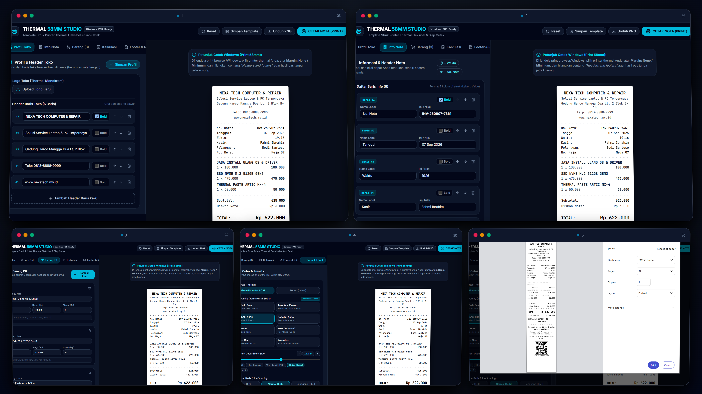

<p align="center">
  
</p>

# 🖨️ Thermal Receipt 58mm Studio

[](https://reactjs.org/)
[](https://vitejs.dev/)
[](https://tailwindcss.com/)
[](LICENSE)

> Generator struk kasir & template cetak printer thermal **58mm** fleksibel berbasis web, dirancang khusus agar langsung pas dan presisi pada Windows Print Dialog tanpa terpotong.

---

## ✨ Fitur Utama

- 📐 **Format Presisi 58mm POS:** Layout CSS `@media print` murni hitam-putih dengan area cetak efektif ~48-52mm.
- 🏪 **Kustomisasi Profil Usaha:** Nama usaha, slogan, logo monokrom (dengan slider ukuran), alamat, nomor telepon/WhatsApp, dan website.
- 🔤 **Pilihan 8 Font Family Khusus Struk:**
  - `Share Tech Mono` (Standar POS Modern)
  - `Courier Prime` (Mesin Tik Klasik)
  - `JetBrains Mono` (Ultra Sharp & Rapi)
  - `Roboto Mono` (Geometris)
  - `Space Mono` (Modern Tech)
  - `VT323` (Dot Matrix Kasir Jadul / Retro)
  - `Courier New` & `Consolas` (Bawaan Windows)
- 🎚️ **Pengaturan Ukuran Font & Jarak Baris:** Slider ukuran font (`8px` - `16px`) dengan tombol preset, serta line-height fleksibel.
- 🧾 **Detail Transaksi Fleksibel:** Nomor nota (dengan auto-generate), tanggal/jam realtime, kasir, pelanggan, nomor meja/order, dan pilihan metode pembayaran (Tunai, QRIS, Transfer, Debit).
- 🛒 **Daftar Barang Dinamis:** Tambah/hapus item tanpa batas, input nama, kuantitas, harga, diskon per item, dan catatan (misal: *Less Ice / Size L*).
- 💰 **Kalkulasi & Pembayaran Otomatis:**
  - Subtotal terhitung instan.
  - Diskon nota keseluruhan / voucher potongan.
  - Pajak / PPN (% toggle).
  - Biaya layanan / ongkir (toggle).
  - Grand total tercetak tebal.
  - Pilihan pecahan uang bayar cepat & kalkulasi kembalian otomatis.
- 📱 **QR Code & Barcode Generator:** Otomatis menghasilkan kode QRIS/URL dan Barcode Code 128 di struk.
- 💾 **Penyimpanan Profil Lokal (LocalStorage):** Simpan data template toko agar tidak perlu mengetik ulang saat membuka browser kembali.
- 🖼️ **Unduh Gambar (PNG):** Simpan nota dalam format gambar selain langsung mencetak fisik.
- ⚡ **Preset Sekali Klik:** Template bawaan untuk Kafe/Resto, Minimarket/Retail, dan Jasa/Servis Komputer.

---

## 🚀 Memulai (Getting Started)

### Prasyarat
- [Node.js](https://nodejs.org/) (v18+) atau [Bun](https://bun.sh/) (Direkomendasikan)

### Instalasi & Menjalankan

1. Clone repositori:
   ```bash
   git clone https://github.com/fahmiibrahimdevs/thermal-receipt-studio.git
   cd thermal-receipt-studio
   ```

2. Install dependensi:
   ```bash
   bun install
   # atau
   npm install
   ```

3. Jalankan server development:
   ```bash
   bun run dev
   # atau
   npm run dev
   ```

4. Buka browser di:
   ```
   http://localhost:5175
   ```

---

## 🖨️ Panduan Cetak di Windows (Print Dialog Settings)

Untuk hasil cetak terbaik pada printer thermal 58mm:

1. Klik tombol **"CETAK NOTA (PRINT)"** di aplikasi.
2. Di jendela cetak Windows/Browser:
   - **Destination / Printer:** Pilih printer thermal Anda (contoh: *POS-58*, *Thermal Printer*).
   - **Paper Size:** Pilih roll kertas `58mm` / `Roll Paper 58 x 297mm`.
   - **Margins:** Pilih **None** (atau *Minimum*).
   - **Options:** Hilangkan centang pada **"Headers and footers"** agar URL browser dan tanggal tidak ikut tercetak di ujung kertas.
3. Klik **Print**.

---

## 🛠️ Tech Stack

- **Framework:** React 18
- **Bundler:** Vite 6
- **Styling:** Tailwind CSS v4
- **Icons:** Lucide React
- **QR Generator:** `qrcode.react`
- **Barcode Generator:** `jsbarcode`
- **Image Export:** `html-to-image`
- **Runtime:** Bun / Node.js

---

## 📄 Lisensi

Proyek ini berada di bawah lisensi [MIT](LICENSE).

Dibuat dengan ❤️ oleh **[Fahmi Ibrahim](https://github.com/fahmiibrahimdevs)**.
